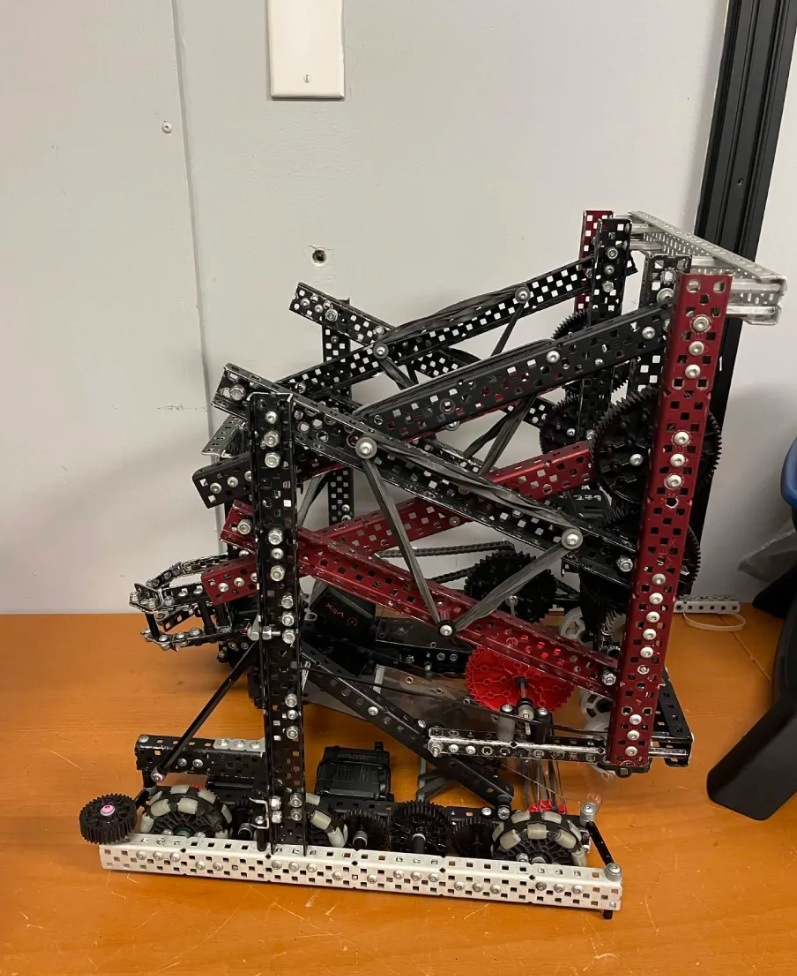

# VEX V5 Override: Personal Build

A robot I've been building independently over summer 2026 for VEX V5 Robotics Competition's 2026-2027 game, Override, as a personal project before starting university.

**Built with:** VEX V5 hardware, Onshape

## About Override

Override is this season's VEX V5 game. Two 2-team alliances compete on a 12'x12' field. Robots score by stacking colored Pins and Cups onto Goals around the field, by controlling four Toggles that determine which alliance's yellow Pins are worth bonus points, and by ending the match with their robot in the contested center Midfield zone.

## Status

Early build. Right now this covers the lift mechanism and base structure, built and photographed over the summer. Drivetrain, additional mechanisms, more photos, and code will get added as the build continues.

## Robot Overview (so far)

- Vertical lift mechanism (DR4B)
- 6-wheel omni drivetrain, 4-motor drive (44W)
- Built with standard VEX V5 structural and motion components

## What's Next

- **Intake:** a mechanism to pick up Pins and Cups off the field and out of the Loaders, most competitive builds use flex wheels or flap-style rollers for this.
- **Finish the lift:** right now it only raises. It still needs a way to actually hold and place scored elements, and ideally reach both the Tall and Short Goals, not just go up and down.
- **Toggle interaction:** some way to flip the field's Toggles to my alliance color, since that's worth real points on top of stacking.
- **Wiring and mounting:** clean up motor/sensor placement once the mechanisms above are locked in.
- **Code:** autonomous and driver control in C++, using PROS and LemLib.
- More build photos as the mechanisms come together.
