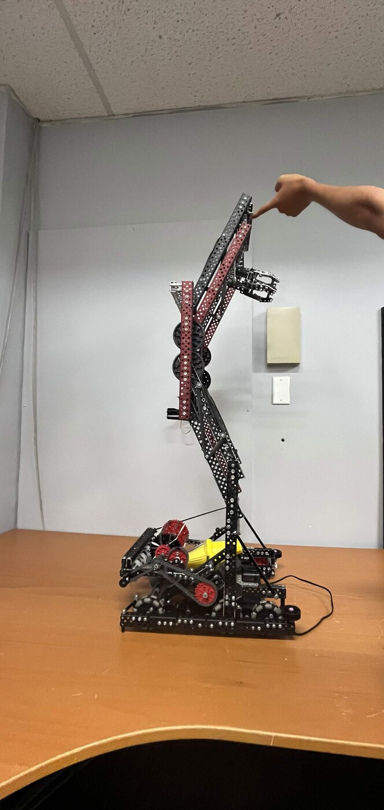
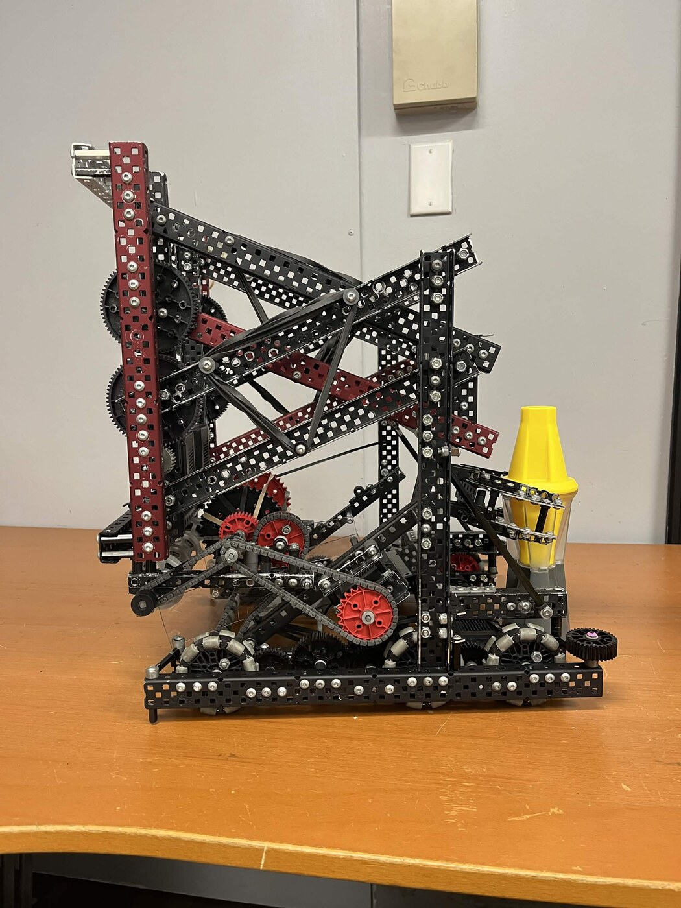

# VEX V5 Override: Personal Build

A robot I've been building independently over summer 2026 for VEX V5 Robotics Competition's 2026-2027 game, Override, as a personal project before starting university.

**Built with:** VEX V5 hardware, Onshape

## About Override

Override is this season's VEX V5 game. Two 2-team alliances compete on a 12'x12' field. Robots score by stacking colored Pins and Cups onto Goals around the field, by controlling four Toggles that determine which alliance's yellow Pins are worth bonus points, and by ending the match with their robot in the contested center Midfield zone.

## Status

Progressing. The lift now ends in a claw-style gripper instead of just raising up, and an intake with chains and rollers is taking shape at the base. Drivetrain, wiring, and code are still to come.

## Robot Overview (so far)

- Vertical lift mechanism (DR4B), now with a claw-style gripper at the end
- Intake with chains and rollers, taking shape at the base
- 6-wheel omni drivetrain, 4-motor drive (44W)
- Built with standard VEX V5 structural and motion components

## What's Next

- **Finish the intake:** get the chains/rollers picking up Pins and Cups reliably off the field and out of the Loaders.
- **Toggle interaction:** some way to flip the field's Toggles to my alliance color, since that's worth real points on top of stacking.
- **Wiring and mounting:** clean up motor/sensor placement once the mechanisms above are locked in.
- **Code:** autonomous and driver control in C++, using PROS and LemLib.
- More build photos as the mechanisms come together.
